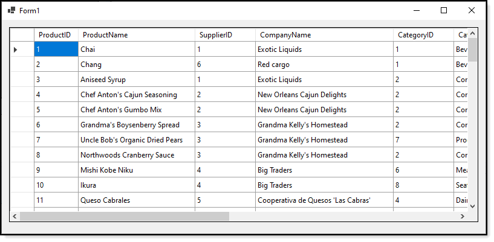
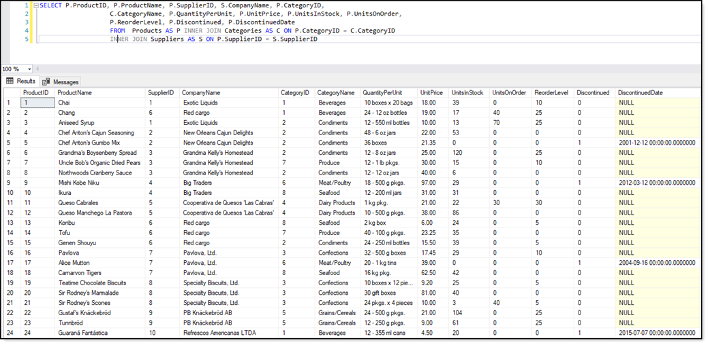

# About

Sample to open tables in [SQL-Server](https://docs.microsoft.com/en-us/sql/?view=sql-server-ver15) using a data provider 
with [asynchronous](https://docs.microsoft.com/en-us/dotnet/csharp/programming-guide/concepts/async/) operations and given timeout for a connection, see the [following article](https://social.technet.microsoft.com/wiki/contents/articles/54260.sql-server-freezes-when-connecting-c.aspx) for more details.

:heavy_check_mark: This is a no-frills user interface.

:heavy_check_mark: Uses C#8, C#9 features



## Entity Framework Core

Although working with a SqlConnection object and SqlCommand object fits many situations, consider exploring working with [Entity Framework Core](https://docs.microsoft.com/en-us/ef/core/). See the following [TechNet article](https://social.technet.microsoft.com/wiki/contents/articles/53881.entity-framework-core-3-projections.aspx) for a intermediate example (the version is back one version but will work with the current version)


# Requires 

:heavy_check_mark: The following [database script](https://gist.github.com/karenpayneoregon/9bdf1a7d5310ac1d562b2326d79d6038) to run.


Once this project is open in Visual Studio with .NET 5 installed, double click on the project 
node (the project name) in Visual Studio which open too.

Note if this was a console app remove the **-window** section from the TargetFramework node.


```xml
<Project Sdk="Microsoft.NET.Sdk">


	<PropertyGroup>
		<OutputType>WinExe</OutputType>
		<LangVersion>9.0</LangVersion>
		<TargetFramework>net5.0-windows</TargetFramework>
		<UseWindowsForms>true</UseWindowsForms>
	</PropertyGroup>


	<ItemGroup>
	  <PackageReference Include="System.Data.SqlClient" Version="4.8.2" />
	</ItemGroup>


</Project>
```

# Data container

:green_circle:  **DataTableResults**

| Property | Type | Definition
| :---- | :---- | :----
| DataTable | DataTable | Container to return data
| ConnectionFailed | bool | Set when there is a connection to the server failure
| ExceptionMessage | string | General exception message
| GeneralException | Exception | General exception if not connection failure
| HasException | bool | Indicates if there was an exception thrown

:green_circle:  Contains concrete class for returning data for DataOpertions.ReadProductsTask().


Note the `ItemGroup` section, this informs .NET that a package for `System.Data.SqlClient` is needed. When building this project Visual Studio should restore the package and if not
 right click on the project name in solution explorer, select `manage NuGet packages`, do a restore by pressing the restore button.

Or simply install via [instructions here](https://www.nuget.org/packages/System.Data.SqlClient/).

Now build the project.

# SQL

The SQL statement was created in SSMS (SQL-Server Management Studio) and pasted into DataOperations.SelectStatement().

