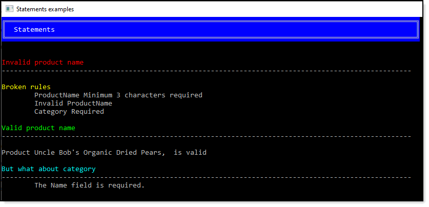

# About

This library contains code to perform validation on properties in a class rigged with data annotation.

Normally this project will be in a team library, referenced conventionally or from a public or internal NuGet feed.


:heavy_check_mark: Code presented was ported from 

- A .NET Framework classic to .NET Core Framework class project
- Converted from VB.NET to C#


# Microsoft TechNet article

[.NET: Defensive data programming (Part 4) Data Annotation](https://social.technet.microsoft.com/wiki/contents/articles/53055.net-defensive-data-programming-part-4-data-annotation.aspx)


# Basic C# example

A Product class with a property of type Category are used for demonstrating validating several properties are validated using `rules`.



## Class definitions

---

```csharp
/*
 * Both classes belong in separate files, for teaching they are as is.
 */

#nullable enable
using System.ComponentModel.DataAnnotations;

namespace ConsoleApp1.Classes.Version_8_and_9
{
    public class Product
    {
        /// <summary>
        /// Primary key
        /// </summary>
        public int Id { get; set; }
        /// <summary>
        /// Name of product
        /// </summary>
        [RegularExpression("^.{3,}$", ErrorMessage = "{0} Minimum 3 characters required")]
        [Required(ErrorMessage = "{0} Required")]
        [StringLength(40, MinimumLength = 3, ErrorMessage = "Invalid {0}")]
        public string ProductName { get; set; }
        /// <summary>
        /// Category for product
        /// </summary>
        [Required(ErrorMessage = "{0} Required")]
        public Category Category { get; set; }
        /// <summary>
        /// Provides ability to see specific information during debug sessions and more
        /// </summary>
        /// <returns></returns>
        /// <remarks>
        /// null coalescing on category name else if not set it's a null reference exception
        /// </remarks>
        public override string ToString() => $"{ProductName}, {Category?.Name ?? "(none)"}";
    }

    public class Category
    {
        /// <summary>
        /// Primary key
        /// </summary>
        public int Id { get; set; }
        /// <summary>
        /// Name of category
        /// </summary>        
        [Required]
        [MaxLength(10)]
        public string Name { get; set; }
        public override string ToString() => Name;

    }
}
```
## Validation

Here simple validation is done

```csharp
using System;
using static ConsoleHelpers.ConsoleColors;
using ConsoleApp1.Classes.Version_8_and_9;
using static ValidationLibrary.ValidationHelper;

namespace ConsoleApp1.Classes
{
    public class ValidateProduct
    {
        public static void InValidProductName()
        {
            WriteRed("Invalid product name");
            EmptyLine();
            
            var product = new Product() { ProductName = "A" };
            var validationResult = ValidateEntity(product);
            
            if (validationResult.HasError)
            {
                WriteYellow("Broken rules", false);
                
                foreach (var validationResultError in validationResult.Errors)
                {
                    WriteIndented(validationResultError.ErrorMessage);
                }
            }
            else
            {
                Console.WriteLine("Product is valid");
            }
        }
        public static void ValidProductName()
        {
            WriteGreen("Valid product name");
            EmptyLine();
            
            var product = new Product()
            {
                ProductName = "Uncle Bob's Organic Dried Pears", 
                Category = new Category() {Name = ""}
            };
            
            var validationResult = ValidateEntity(product);
            
            if (validationResult.HasError)
            {
                foreach (var validationResultError in validationResult.Errors)
                {
                    WriteIndented(validationResultError.ErrorMessage);
                }
            }
            else
            {
                Console.WriteLine($"Product {product} is valid");
            }
            
            EmptyLine();
            
            WriteCyan("But what about category");
            
            validationResult = ValidateEntity(product.Category);
            
            if (validationResult.HasError)
            {
                foreach (var validationResultError in validationResult.Errors)
                {
                    WriteIndented(validationResultError.ErrorMessage);
                }
            }
            else
            {
                Console.WriteLine($"Product {product} is valid");
            }

        }

        public static void Run()
        {
            InValidProductName();
            EmptyLine();
            ValidProductName();
        }
    }
}
```
---

## SS validation

**Person class**

```csharp
namespace AnnotationUnitTest.Classes
{
    public class Person
    {
        [Required(ErrorMessage = "{0} is required"), DataType(DataType.Text)]
        [StringLength(20, MinimumLength = 6)]
        public string FirstName { get; set; }
        [Required(ErrorMessage = "{0} is required"), DataType(DataType.Text)]
        [StringLength(10)]
        public string LastName { get; set; }
        [Required(ErrorMessage = "{0} is required"), DataType(DataType.Text)]
        [Phone]
        public string Phone { get; set; }
        [SocialSecurity] public string SSN { get; set; }
    }
}
```

**Unit test methd**

```csharp
using System;
using AnnotationUnitTest.Classes;
using Microsoft.VisualStudio.TestTools.UnitTesting;
using ValidationLibrary;
using ValidationLibrary.CommonRules;
using ValidationLibrary.ExtensionMethods;

namespace AnnotationUnitTest
{
    [TestClass]
    public class UnitTest1
    {
        /// <summary>
        /// Validate a file extension is one of the default extensions png,jpg,jpeg,gif
        /// </summary>
        [TestMethod]
        public void FileExtensionsExample()
        {
            FileItem fileItem = new FileItem() {Name = "test.jpg"};

            EntityValidationResult validationResult = ValidationHelper.ValidateEntity(fileItem);
            Assert.IsFalse(validationResult.HasError);

            fileItem.Name = "test.xsd";
            validationResult = ValidationHelper.ValidateEntity(fileItem);
            Assert.IsTrue(validationResult.HasError);
        }
        /// <summary>
        /// Validate no phone number
        /// </summary>
        [TestMethod]
        public void PersonPhoneExample()
        {
            Person  person = new Person() {FirstName = "Bob", LastName = "Jones", SSN = "201518161" };

            EntityValidationResult validationResult = ValidationHelper.ValidateEntity(person);
            Assert.IsTrue(validationResult.HasError);
            Assert.IsTrue(validationResult.ErrorMessageList().Contains("Phone is required"));
        }
        /// <summary>
        /// Validate missing first name
        /// </summary>
        [TestMethod]
        public void PersonFirstNameMissingExample()
        {
            Person person = new Person()
            {
                FirstName = "Jimmy Bob",
                LastName = "Jones",
                Phone = "(305) 444-9999",
                SSN = "201518161"
            };

            EntityValidationResult validationResult = 
                ValidationHelper.ValidateEntity(person);

            Assert.IsFalse(validationResult.HasError);
            var test = validationResult.Errors;
            person.FirstName = "";
            validationResult = ValidationHelper.ValidateEntity(person);

            Assert.IsTrue(validationResult.Errors.Count == 1 && 
                          validationResult.ErrorMessageList().Contains("First Name"));

        }
        /// <summary>
        /// Here there is a bad SSN, see remarks in <seealso cref="SocialSecurityAttribute"/>
        /// </summary>
        [TestMethod]
        public void PersonSocialSecurityExample()
        {
            Person person = new Person()
            {
                FirstName = "Jimmy Bob",
                LastName = "Jones",
                Phone = "(305) 444-9999",
                SSN = "078-05-1120"
            };

            EntityValidationResult validationResult = 
                ValidationHelper.ValidateEntity(person);

            Console.WriteLine(validationResult.ErrorMessageList());
            Assert.IsTrue(validationResult.HasError);
          

        }
    }
}

```
